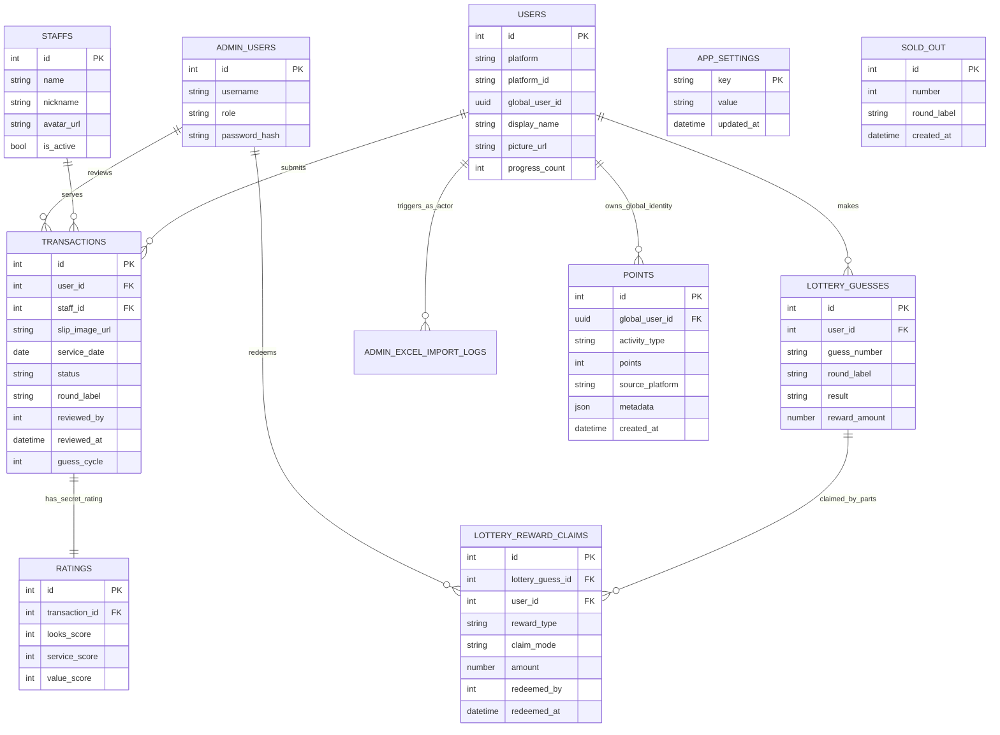
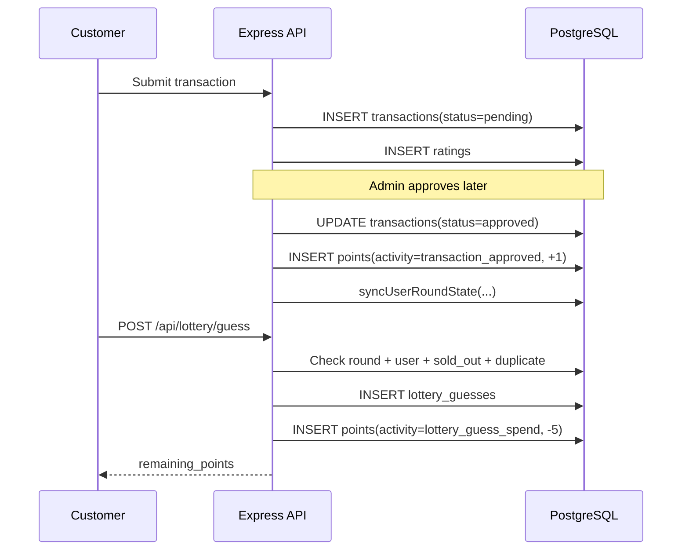
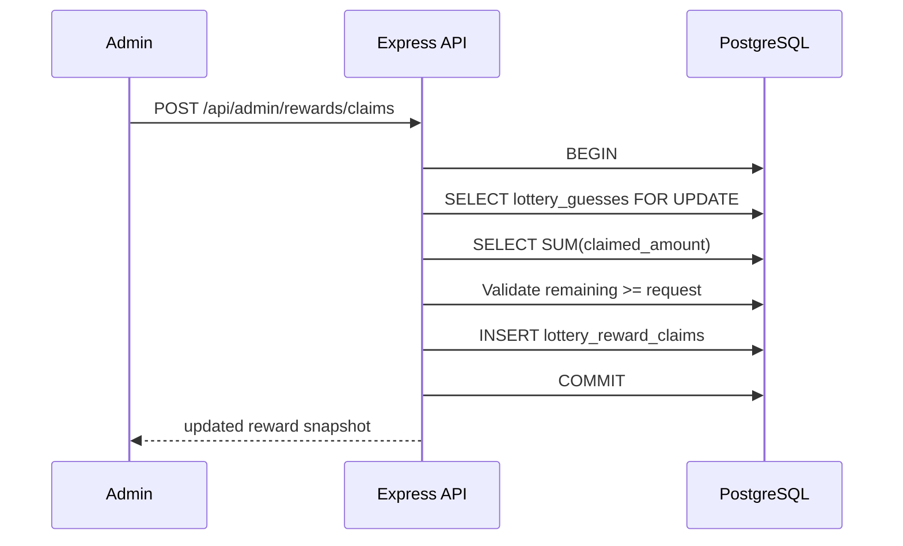
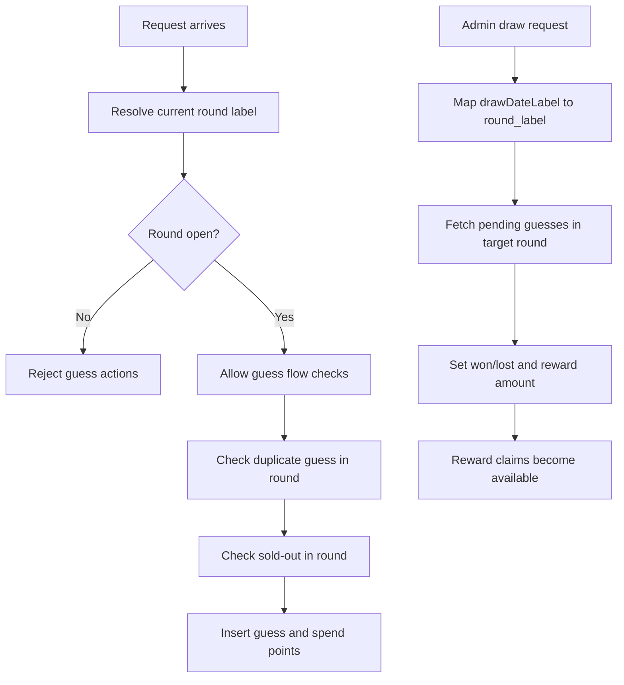

# Diagrams: ERD And Key Flows

## 1) Core ERD

## 2) Point Ledger Sequence

## 3) Reward Claim Sequence

## 4) Round And Draw Logic Flow

## 5) Notes

- Diagram นี้เป็น architecture-and-logic map จาก implementation ปัจจุบัน
- ก่อนใช้เป็นเอกสารทางการของทีม ควรเทียบกับ schema ล่าสุดในทุก environment