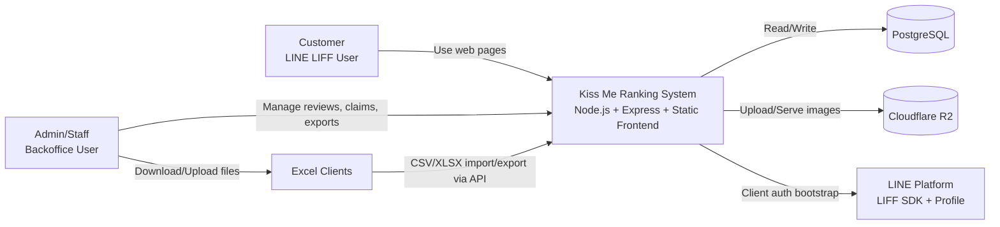
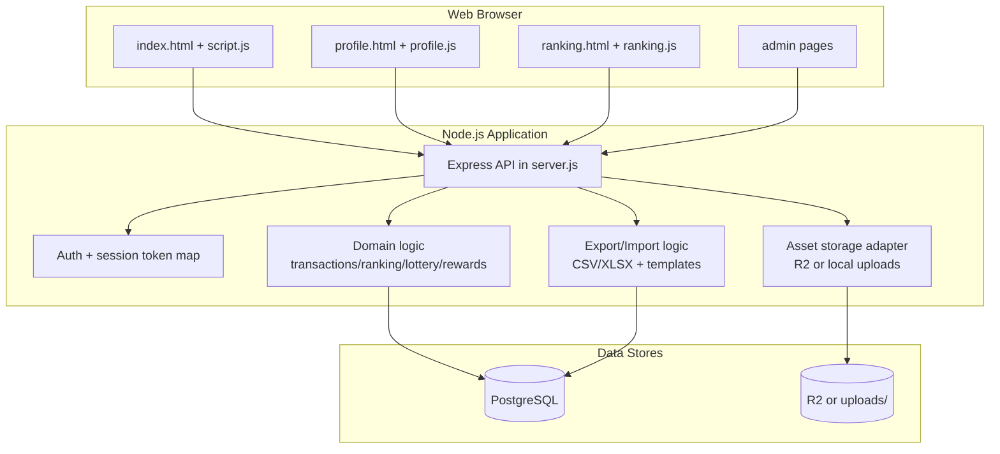
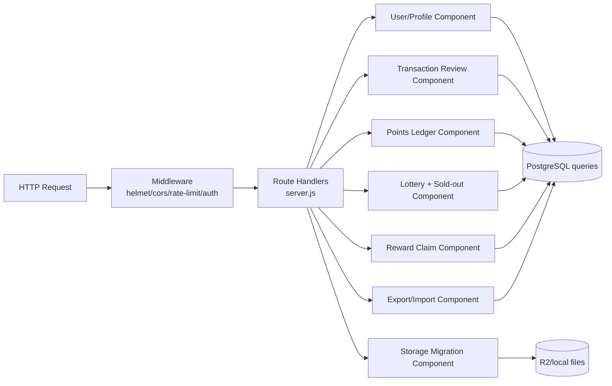

# C4 Architecture Diagrams

## 1) C4 Context

## 2) C4 Container

## 3) C4 Component (Backend)

## 4) Runtime Ownership Map

- Entry point: `server.js`
- Core data logic: SQL queries embedded in route/domain helper functions
- Frontend runtime: static pages loaded directly by browser
- Session/auth model: in-memory token map for admin sessions
- Persistent truth: PostgreSQL tables + constraints

## 5) Refactor Landing Zones

- Extract auth, reward, and points into separate modules first
- Move export/import logic to dedicated services
- Introduce shared validation utilities for API and Excel import
- Add repository/query layer to reduce SQL duplication